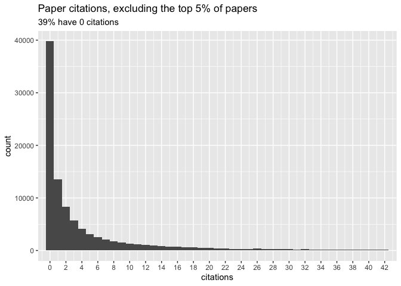

Citations (Microsoft)
================
2020-03-04

  - [How many papers were successfully accessed using the Microsoft
    API?](#how-many-papers-were-successfully-accessed-using-the-microsoft-api)
  - [Do all accessed papers have citation
    data?](#do-all-accessed-papers-have-citation-data)
  - [How many papers have more than 0
    citations?](#how-many-papers-have-more-than-0-citations)
  - [Distribution of citations](#distribution-of-citations)
  - [How many papers have DOIs (from Microsoft
    API)?](#how-many-papers-have-dois-from-microsoft-api)

``` r
# Libraries
library(tidyverse)

# Parameters
file_citations <- here::here("data/citations_microsoft.rds")
file_papers <- here::here("data/papers.rds")
#===============================================================================

# Code
citations <- read_rds(file_citations)
papers <- read_rds(file_papers)
```

### How many papers were successfully accessed using the Microsoft API?

All papers in `papers` are listed in `citations`.

``` r
setequal(citations$id_arxiv, papers$id)
```

    ## [1] TRUE

``` r
citations %>% 
  count(accessed = !is.na(id_mc), sort = TRUE) %>% 
  mutate(prop = n / sum(n)) %>% 
  ungroup()
```

    ## # A tibble: 2 x 3
    ##   accessed      n   prop
    ##   <lgl>     <int>  <dbl>
    ## 1 TRUE     101611 0.958 
    ## 2 FALSE      4480 0.0422

95% were successfully accessed.

### Do all accessed papers have citation data?

``` r
citations %>% 
  filter(!is.na(id_mc), is.na(citations))
```

    ## # A tibble: 0 x 8
    ## # … with 8 variables: id_arxiv <chr>, id_mc <chr>, title_arxiv <chr>,
    ## #   title_mc <chr>, citations <int>, authors <list>, doi <chr>, log_prob <dbl>

There are no papers with a Microsoft ID and no citation data.

### How many papers have more than 0 citations?

``` r
citations %>% 
  count(cited = citations > 0, sort = TRUE) %>% 
  mutate(prop = n / sum(n)) %>% 
  ungroup()
```

    ## # A tibble: 3 x 3
    ##   cited     n   prop
    ##   <lgl> <int>  <dbl>
    ## 1 TRUE  61830 0.583 
    ## 2 FALSE 39781 0.375 
    ## 3 NA     4480 0.0422

### Distribution of citations

``` r
citations %>% 
  summarize_at(
    vars(citations), 
    list(min = min, max = max, median = median), na.rm = TRUE
  )
```

    ## # A tibble: 1 x 3
    ##     min   max median
    ##   <int> <int>  <int>
    ## 1     0 14645      1

The median number of citations is 1.

``` r
quantile(citations$citations, na.rm = TRUE)
```

    ##    0%   25%   50%   75%  100% 
    ##     0     0     1     6 14645

For papers with at least 1 citation.

``` r
citations %>% 
  drop_na(citations) %>% 
  filter(citations < quantile(citations, probs = .95)) %>% 
  ggplot(aes(citations)) +
  geom_histogram(binwidth = 1) +
  scale_x_continuous(
    breaks = scales::breaks_width(width = 2), 
    expand = c(0, 1)
  ) +
  labs(
    title = "Paper citations, excluding the top 5% of papers",
    subtitle = "39% have 0 citations"
  )
```

<!-- -->

``` r
citations %>% 
  drop_na(citations) %>% 
  count(citations, sort = TRUE) %>% 
  mutate(prop = round(n / sum(n) * 100, 3))
```

    ## # A tibble: 667 x 3
    ##    citations     n  prop
    ##        <int> <int> <dbl>
    ##  1         0 39781 39.2 
    ##  2         1 13577 13.4 
    ##  3         2  8292  8.16
    ##  4         3  5700  5.61
    ##  5         4  4086  4.02
    ##  6         5  3135  3.08
    ##  7         6  2514  2.47
    ##  8         7  2102  2.07
    ##  9         8  1699  1.67
    ## 10         9  1563  1.54
    ## # … with 657 more rows

### How many papers have DOIs (from Microsoft API)?

``` r
citations %>% 
  count(has_doi = !is.na(doi), sort = TRUE) %>% 
  mutate(prop = n / sum(n)) %>% 
  ungroup()
```

    ## # A tibble: 2 x 3
    ##   has_doi     n  prop
    ##   <lgl>   <int> <dbl>
    ## 1 FALSE   75757 0.714
    ## 2 TRUE    30334 0.286

Only 28% have DOIs.

Combined with the arXiv data, how many papers have DOIs?

``` r
combined_doi <-
  citations %>% 
  select(id_arxiv, doi_mc = doi) %>% 
  left_join(
    papers %>% select(id, title, doi_arxiv = doi), 
    by = c("id_arxiv" = "id")
  ) %>% 
  mutate_at(vars(contains("doi")), str_to_lower) 
```

Are the DOIs the same for the papers that have both?

``` r
combined_doi %>% 
  drop_na(starts_with("doi")) %>% 
  count(same = doi_arxiv == doi_mc, sort = TRUE)
```

    ## # A tibble: 2 x 2
    ##   same      n
    ##   <lgl> <int>
    ## 1 TRUE  11153
    ## 2 FALSE   265

Most are the same.

How many papers have at least one DOI listed?

``` r
combined_doi %>% 
  mutate(doi = coalesce(doi_mc, doi_arxiv)) %>% 
  count(has_doi = !is.na(doi), sort = TRUE) %>% 
  mutate(prop = n / sum(n)) %>% 
  ungroup()
```

    ## # A tibble: 2 x 3
    ##   has_doi     n  prop
    ##   <lgl>   <int> <dbl>
    ## 1 FALSE   73752 0.695
    ## 2 TRUE    32339 0.305

Only 30%.
