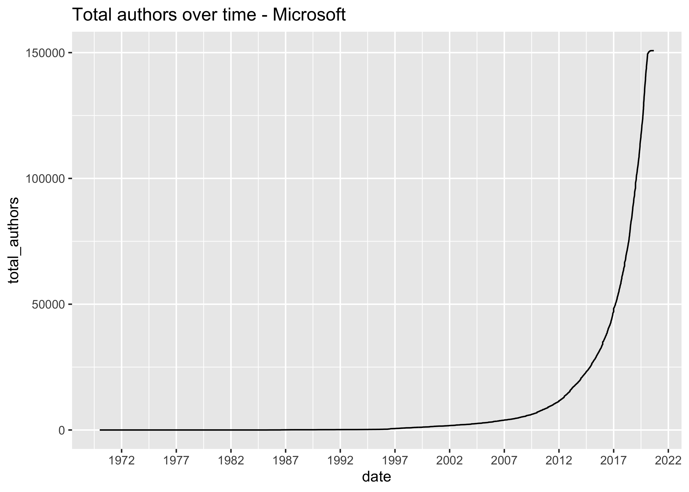
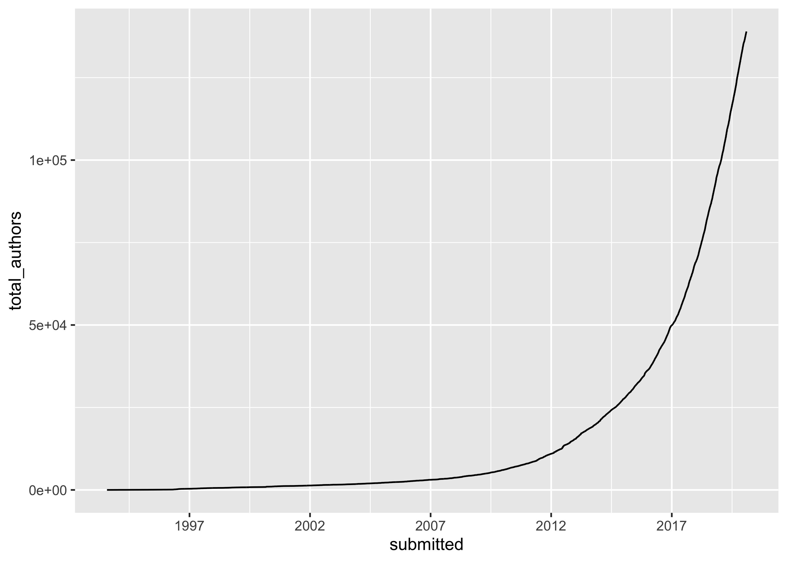
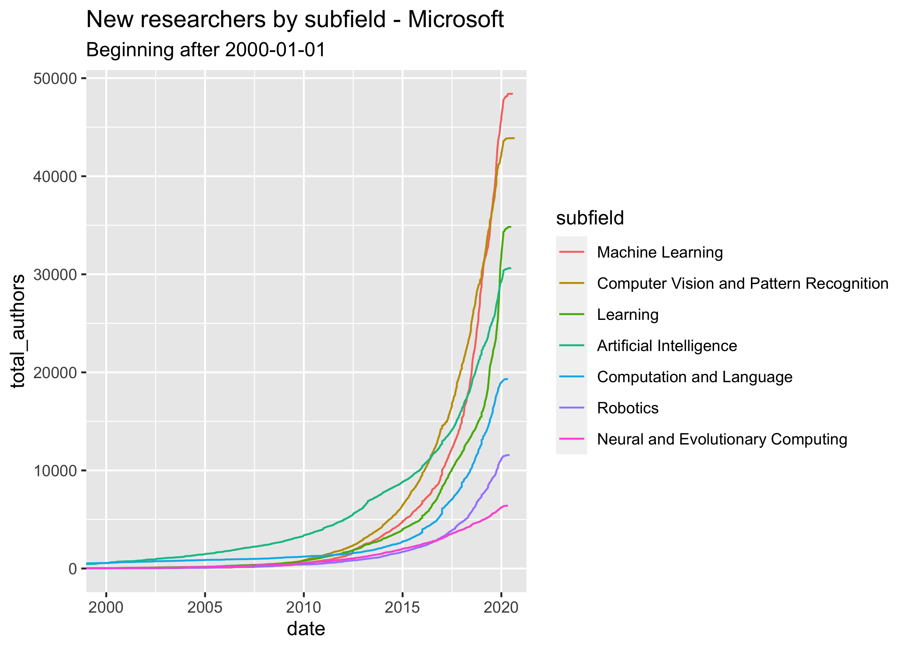
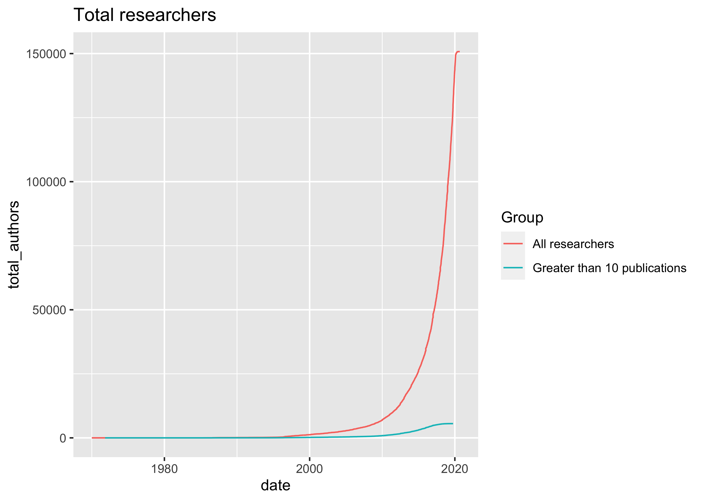
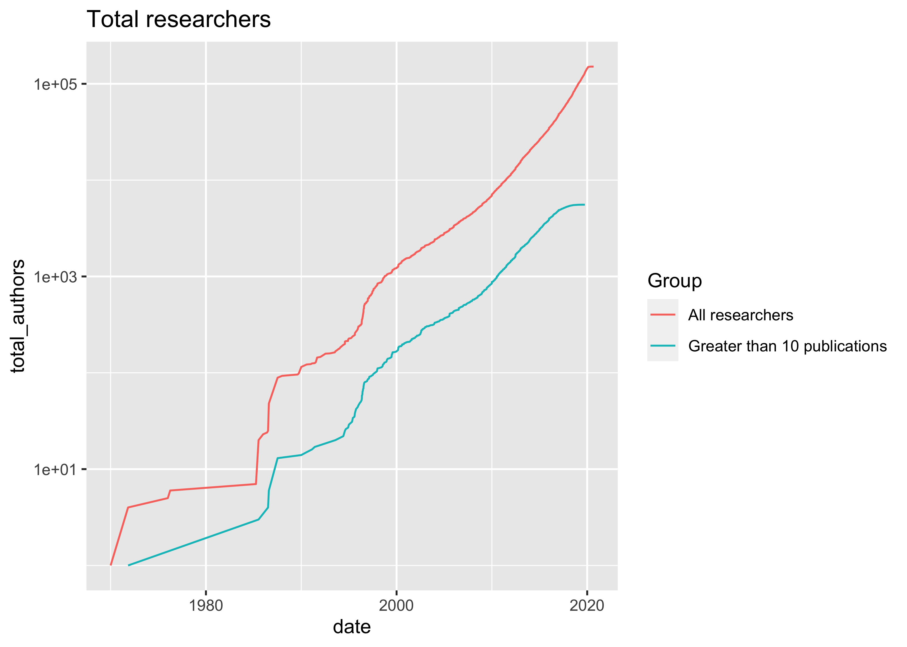
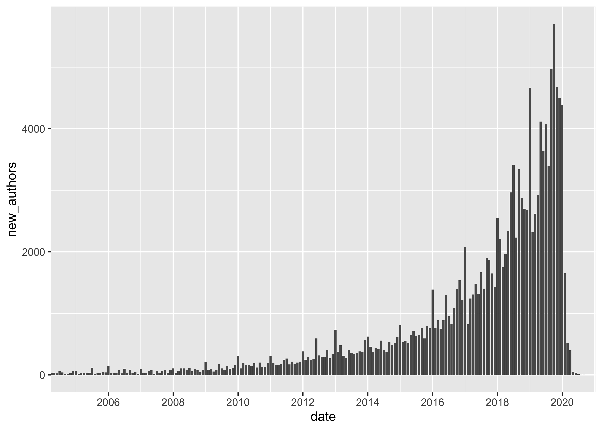

New authors - Microsoft
================
Sara Altman
2020-04-05

  - [All new researchers](#all-new-researchers)
  - [Total researchers by subfield](#total-researchers-by-subfield)
  - [Total researchers with \>= 10 total
    publications](#total-researchers-with-10-total-publications)
  - [New researchers, by month](#new-researchers-by-month)

``` r
# Libraries
library(tidyverse)

# Parameters
file_ms <- here::here("data/microsoft/ms_authors_new.rds")
file_ms_subfields <- here::here("data/microsoft/ms_authors_new_subfields.rds")
file_ms_10 <- here::here("data/microsoft/ms_authors_new_10.rds")
file_arxiv <- here::here("data/arxiv/arxiv_authors_new.rds")

file_subfields <- here::here("data/arxiv/subfields.rds")

#===============================================================================
ms <-
  file_ms %>% 
  read_rds()

ms_subfields <-
  file_ms_subfields %>% 
  read_rds() %>% 
  rename(subfield_code = subfield) %>% 
  left_join(
    read_rds(file_subfields) %>% select(subfield, code), 
    by = c("subfield_code" = "code")
  )

ms_10 <-
  file_ms_10 %>% 
  read_rds()

arxiv <-
  file_arxiv %>% 
  read_rds()
```

## All new researchers

``` r
ms %>% 
  ggplot(aes(date, total_authors)) +
  geom_line() +
  scale_x_date(date_breaks = "5 years", date_labels = "%Y") +
  labs(
    title = "Total authors over time - Microsoft"
  )
```

<!-- -->

One major advantage of the Microsoft data is that it has publication
date. arXiv only has the data that the paper was submitted to arXiv.

``` r
arxiv %>% 
  ggplot(aes(submitted, total_authors)) +
  geom_line() +
  scale_x_date(date_breaks = "5 years", date_labels = "%Y")
```

<!-- -->

## Total researchers by subfield

``` r
ms_subfields %>% 
  mutate(subfield = fct_reorder2(subfield, date, total_authors)) %>% 
  ggplot(aes(date, total_authors, color = subfield)) +
  geom_line() +
  coord_cartesian(
    xlim = c(lubridate::ymd("2000-01-01"), lubridate::today())
  ) +
  labs(
    title = "New researchers by subfield - Microsoft",
    subtitle = "Beginning after 2000-01-01"
  )
```

<!-- -->

## Total researchers with \>= 10 total publications

``` r
ms_10 %>% 
  bind_rows(
    "Greater than 10 publications" = ., 
    "All researchers" = ms, 
    .id = "Group"
  ) %>% 
  ggplot(aes(date, total_authors, color = Group)) +
  geom_line() +
  labs(
    title = "Total researchers"
  )
```

<!-- -->

It’s hard to tell from this plot, but the growth in researchers with 10+
publications is also exponential. This is easier to see if you
log-transform the y-axis.

``` r
ms_10 %>% 
  bind_rows(
    "Greater than 10 publications" = .,
    "All researchers" = ms,
    .id = "Group"
  ) %>%
  ggplot(aes(date, total_authors, color = Group)) +
  geom_line() +
  scale_y_log10() +
  labs(
    title = "Total researchers"
  )
```

<!-- -->

## New researchers, by month

Here’s another way of looking at the data: new researchers over time,
grouped by month (to reduce spikiness).

``` r
ms %>% 
  group_by(date = lubridate::floor_date(date, unit = "month")) %>% 
  summarize(new_authors = sum(new_authors, na.rm = TRUE)) %>% 
  ggplot(aes(date, new_authors)) +
  geom_col() +
  coord_cartesian(
    xlim = c(lubridate::ymd("2005-01-01"), lubridate::today())
  ) +
  scale_x_date(date_breaks = "2 years", date_labels = "%Y")
```

<!-- -->
