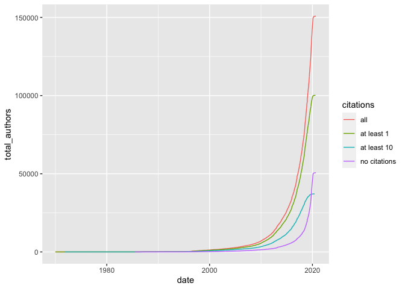

New authors by citation counts
================
Sara Altman
2020-04-22

``` r
# Libraries
library(tidyverse)

# Parameters
file_new_authors <- here::here("data/microsoft/ms_authors_new.rds")
file_new_authors_0 <- here::here("data/microsoft/ms_authors_new_0.rds")
file_new_authors_1 <- here::here("data/microsoft/ms_authors_new_1.rds")
file_new_authors_10 <- here::here("data/microsoft/ms_authors_new_10.rds")
#===============================================================================

authors <-
  bind_rows(
    all = read_rds(file_new_authors),
    `no citations` = read_rds(file_new_authors_0),
    `at least 1` = read_rds(file_new_authors_1),
    `at least 10` = read_rds(file_new_authors_10),
    .id = "citations"
  )
```

``` r
authors %>% 
  ggplot(aes(date, total_authors, color = citations)) +
  geom_line()
```

<!-- -->
