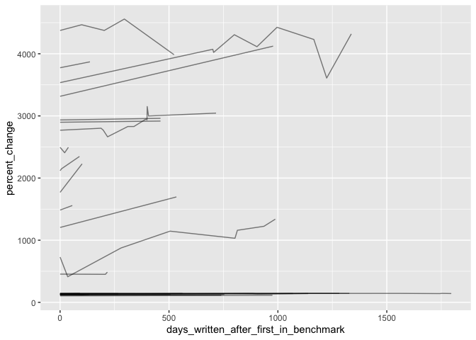

SOTA
================
Sara Altman
3/11/2020

``` r
# Libraries
library(tidyverse)

# Parameters
file_sota <- here::here("data/sota/sota.rds")

#===============================================================================

sota <- read_rds(file_sota)
```

## Understanding benchmarks

Each task has one benchmark ID.

``` r
sota %>% 
  group_by(task) %>% 
  summarize(num_benchmarks = n_distinct(benchmark_id, na.rm = TRUE)) %>% 
  count(num_benchmarks)
```

    ## # A tibble: 1 x 2
    ##   num_benchmarks     n
    ##            <int> <int>
    ## 1              1   214

The benchmark IDs are unique identifiers of the tasks.

``` r
n_distinct(sota$benchmark_id) == n_distinct(sota$task)
```

    ## [1] TRUE

Some benchmarks are associated with multiple metrics.

``` r
sota %>% 
  group_by(benchmark_id, task) %>% 
  summarize(num_metrics = n_distinct(metric_name, na.rm = TRUE)) %>% 
  ungroup() %>% 
  arrange(desc(num_metrics))
```

    ## # A tibble: 214 x 3
    ##    benchmark_id task                                         num_metrics
    ##           <dbl> <chr>                                              <int>
    ##  1          226 ECG Classification                                     6
    ##  2          599 Dense Pixel Correspondence Estimation                  5
    ##  3           72 Music Source Separation                                4
    ##  4           93 Image Inpainting                                       4
    ##  5          109 Text Generation                                        4
    ##  6          411 Recommendation Systems                                 4
    ##  7          667 Relationship Extraction (Distant Supervised)           4
    ##  8           26 Image-to-Image Translation                             3
    ##  9           34 Text-To-Speech Synthesis                               3
    ## 10           40 Hypernym Discovery                                     3
    ## # … with 204 more rows

Does each task belong to a distinct category set?

``` r
sota %>% 
  select(index, task, categories) %>% 
  mutate(categories = map_chr(categories, ~ sort(.) %>% str_c(collapse = ", "))) %>% 
  group_by(task) %>% 
  summarize(
    distinct_category_groups = n_distinct(categories, na.rm = TRUE), 
    sort = TRUE
  ) %>% 
  pull(sort) %>% 
  all()
```

    ## [1] TRUE

Yes, each task is mapped to one category set.

## Categories

``` r
sota %>% 
  unnest(cols = categories) %>% 
  count(categories) %>% 
  mutate(categories = fct_reorder(categories, n)) %>% 
  ggplot(aes(n, categories)) +
  geom_point() +
  scale_x_continuous(breaks = scales::breaks_width(width = 50)) +
  labs(
    title = "Number of SOTA measurements by category",
    subtitle = "NLP and computer vision have the most data"
  )
```

<!-- -->

``` r
sota %>% 
  unnest(cols = categories) %>% 
  distinct(categories, task) %>% 
  count(categories) %>% 
  mutate(categories = fct_reorder(categories, n)) %>%
  ggplot(aes(n, categories)) +
  geom_point() +
  scale_x_continuous(breaks = scales::breaks_width(width = 50)) +
  labs(
    title = "Number of distinct tasks by category",
    subtitle = "Computer vision and NLP have the most tasks"
  )
```

<!-- -->

## Missing metrics

``` r
sota %>% 
  mutate_at(vars(metric_name, metric_result), list(missing = is.na)) %>% 
  count(metric_name_missing, metric_result_missing, sort = TRUE) %>% 
  mutate(prop = n / sum(n))
```

    ## # A tibble: 1 x 4
    ##   metric_name_missing metric_result_missing     n  prop
    ##   <lgl>               <lgl>                 <int> <dbl>
    ## 1 FALSE               FALSE                   744     1

33% are missing a metric name and a metric value. There are 7 rows
missing a metric value, but not a metric name. These are rows where I
was not able to turn the metric value into a double (e.g., it was a
word).

Missing metrics by category

``` r
missing_metrics <-
  sota %>% 
  unnest(cols = categories) %>% 
  group_by(categories) %>% 
  summarize(
    prop_missing = sum(is.na(metric_result)) / n(),
    n = n()
  ) 

missing_metrics %>% 
  arrange(desc(prop_missing))
```

    ## # A tibble: 15 x 3
    ##    categories                  prop_missing     n
    ##    <chr>                              <dbl> <int>
    ##  1 Adversarial                            0     2
    ##  2 Audio                                  0     4
    ##  3 Computer Code                          0     8
    ##  4 Computer Vision                        0   259
    ##  5 Graphs                                 0    36
    ##  6 Knowledge Base                         0     1
    ##  7 Medical                                0    31
    ##  8 Methodology                            0    29
    ##  9 Miscellaneous                          0    19
    ## 10 Music                                  0    20
    ## 11 Natural Language Processing            0   306
    ## 12 Playing Games                          0    11
    ## 13 Reasoning                              0     7
    ## 14 Speech                                 0    15
    ## 15 Time Series                            0    15

The Robots category is missing 100% of its metrics.

``` r
missing_metrics %>% 
  mutate(categories = fct_reorder(categories, prop_missing)) %>% 
  ggplot(aes(prop_missing, categories, size = n)) +
  geom_vline(xintercept = 0.5, color = "white", size = 1.5) +
  geom_point() +
  scale_x_continuous(
    breaks = scales::breaks_width(width = .1), 
    limits = c(0, 1)
  ) +
  labs(
    title = "Missing metrics across categories",
    subtitle = "5 categories are missing over 50% of metric results",
    size = "Number of\nmeasurements"
  )
```

<!-- -->

Computer vision and NLP both have a lot of data and relatively low
proportions of missing data, so they are probably going to be the most
reliable categories.

``` r
observations <-
  sota %>% 
  drop_na(metric_name, metric_result) %>% 
  count(benchmark_id, metric_name, sort = TRUE)

observations %>% 
  count(n) %>% 
  mutate(prop = nn / sum(nn))
```

    ## # A tibble: 13 x 3
    ##        n    nn    prop
    ##    <int> <int>   <dbl>
    ##  1     1   161 0.540  
    ##  2     2    53 0.178  
    ##  3     3    18 0.0604 
    ##  4     4    21 0.0705 
    ##  5     5    14 0.0470 
    ##  6     6     4 0.0134 
    ##  7     7     9 0.0302 
    ##  8     8     4 0.0134 
    ##  9     9     6 0.0201 
    ## 10    10     3 0.0101 
    ## 11    11     3 0.0101 
    ## 12    16     1 0.00336
    ## 13    17     1 0.00336

41% of the (non-missing) task-metric combinations have only 1 data
point, which means we won’t be able to understand how the metric has
changed over time for those task-metric combinations.

``` r
observations %>% 
  ggplot(aes(n)) +
  geom_histogram(binwidth = 1) +
  labs(title = "Number of observations (metric measurements for a given task)")
```

<!-- -->

Many metrics are only measured once.

``` r
observations_by_category <-
  sota %>% 
  drop_na(metric_result, metric_name) %>% 
  unnest(cols = categories) %>% 
  group_by(categories) %>% 
  count(benchmark_id, metric_name, name = "num_observations") %>% 
  count(num_observations, sort = TRUE, name = "n") %>% 
  ungroup()


observations_by_category %>% 
  group_by(categories) %>% 
  summarize(
    prop_one = n[num_observations == 1] / sum(n),
    n_metrics = sum(n)
  ) %>% 
  mutate(categories = fct_reorder(categories, prop_one, .desc = TRUE)) %>% 
  ggplot(aes(prop_one, categories, size = n_metrics)) +
  geom_point() +
  scale_x_continuous(breaks = scales::breaks_width(0.1)) +
  labs(
    x = "Proportion of metrics with only a single observation",
    title = "Proportion of single observation metrics by category",
    subtitle = "Many metrics are only measured once",
    size = "Number of\ndistinct metrics"
  )
```

<!-- -->

100% of the metrics for reasoning, audio, adversarial, and knowledge
base were only measured once, which means we won’t be able to get
anything meaningful from these categories.

``` r
sota %>% 
  drop_na(metric_result, metric_name) %>% 
  count(benchmark_id, metric_name, sort = TRUE) %>% 
  count(n) %>% 
  mutate(prop = nn / sum(nn))
```

    ## # A tibble: 13 x 3
    ##        n    nn    prop
    ##    <int> <int>   <dbl>
    ##  1     1   161 0.540  
    ##  2     2    53 0.178  
    ##  3     3    18 0.0604 
    ##  4     4    21 0.0705 
    ##  5     5    14 0.0470 
    ##  6     6     4 0.0134 
    ##  7     7     9 0.0302 
    ##  8     8     4 0.0134 
    ##  9     9     6 0.0201 
    ## 10    10     3 0.0101 
    ## 11    11     3 0.0101 
    ## 12    16     1 0.00336
    ## 13    17     1 0.00336

56% of all task-metric combinations have only one data point.

``` r
observations_by_category %>% 
  uncount(weights = n) %>% 
  group_by(categories) %>% 
  summarize(median_observations = median(num_observations)) %>% 
  mutate(categories = fct_reorder(categories, median_observations)) %>% 
  ggplot(aes(median_observations, categories)) +
  geom_point()
```

<!-- -->

## Percent change

``` r
y_limits <- quantile(sota$percent_change, probs = c(0.1, .9), na.rm = TRUE)

sota %>% 
  drop_na(metric_name, metric_result) %>% 
  ggplot(aes(factor(1), percent_change)) +
  geom_boxplot() +
  coord_cartesian(ylim = y_limits) +
  labs(
    title = "Percent change for the middle 80% of the data",
    subtitle = "There are lots of outliers"
  )
```

<!-- -->

``` r
quantile(sota$percent_change, na.rm = TRUE)
```

    ##            0%           25%           50%           75%          100% 
    ## -1.513761e+12  1.188761e+02  1.418372e+02  2.021216e+03  3.851583e+07

``` r
y_limits <- 
    quantile(sota$percent_change, probs = c(0.01, .99), na.rm = TRUE)

sota %>% 
  drop_na(metric_name, metric_result) %>%
  filter(percent_change != 0) %>% 
  unnest(cols = categories) %>% 
  filter(categories != "Playing Games") %>% 
  mutate(
    categories = 
      fct_reorder(categories, percent_change, .desc = TRUE)
  ) %>% 
  ggplot(aes(categories, percent_change)) +
  geom_hline(yintercept = 0, size = 1.5, color = "white") +
  geom_boxplot() +
  scale_y_log10() +
  theme(
    axis.text.x = element_text(angle = 45)
  ) +
  coord_cartesian(ylim = y_limits)
```

    ## Warning: Transformation introduced infinite values in continuous y-axis

    ## Warning in self$trans$transform(x): NaNs produced

    ## Warning: Transformation introduced infinite values in continuous y-axis

    ## Warning: Removed 88 rows containing non-finite values (stat_boxplot).

    ## Warning in scale$trans$transform(coord_limits): NaNs produced

<!-- -->

Methodology has the outliers. There really shouldn’t be negative percent
change. Did I calculate something wrong?

``` r
sota %>% 
  unnest(categories) %>% 
  filter(categories == "Computer Vision") %>% 
  group_by(task) %>% 
  filter(any(percent_change < 0)) %>% 
  ungroup() %>% 
  select(
    paper_id, 
    paper_date, 
    task, 
    metric_name, 
    metric_result, 
    percent_change
  ) %>% 
  arrange(task, metric_name, paper_date)
```

    ## # A tibble: 74 x 6
    ##    paper_id paper_date          task    metric_name metric_result percent_change
    ##       <dbl> <dttm>              <chr>   <chr>               <dbl>          <dbl>
    ##  1     1207 2019-07-26 00:00:00 3D Abs… MPJPE               54.4          -2395.
    ##  2       87 2016-01-30 00:00:00 3D Hum… Average MP…         99            -4441.
    ##  3       86 2017-09-04 00:00:00 3D Hum… Average MP…         70            -3111.
    ##  4       84 2018-07-04 00:00:00 3D Hum… Average MP…         35            -1506.
    ##  5       82 2019-09-03 00:00:00 3D Hum… Average MP…         29            -1230.
    ##  6       81 2019-12-09 00:00:00 3D Hum… Average MP…         28.9          -1226.
    ##  7     1003 2015-06-25 00:00:00 Dense … Viewpoint …          5.84          -168.
    ##  8     1005 2016-11-03 00:00:00 Dense … Viewpoint …         36.9          -1594.
    ##  9     1004 2016-12-06 00:00:00 Dense … Viewpoint …          5.99          -175.
    ## 10     1002 2017-09-07 00:00:00 Dense … Viewpoint …          4.43          -103.
    ## # … with 64 more rows

## SOTA progress

``` r
sota %>% 
  drop_na(percent_change, paper_date)   %>% 
  filter(metric_name != "Number of params") %>% 
  filter(categories != "Playing Games") %>% 
  filter(percent_change > 0) %>%
  unnest(categories) %>% 
  ggplot(aes(days_written_after_first_in_benchmark, percent_change, color = categories)) +
  geom_point() 
```

<!-- -->

``` r
# sota %>% 
#   drop_na(percent_change, paper_date)   %>% 
#   filter(metric_name != "Number of params") %>% 
#   filter(categories != "Playing Games") %>% 
#   filter(percent_change > 0) %>%
#   unnest(categories) %>% 
#   ggplot(aes(days_written_after_first_in_benchmark, percent_change, color = categories)) +
#   geom_smooth(se = FALSE)

sota %>% 
  unnest(categories) %>% 
  filter(categories == "Playing Games")
```

    ## # A tibble: 11 x 15
    ##    index paper_id benchmark_id categories task  model_name paper_date         
    ##    <dbl>    <dbl>        <dbl> <chr>      <chr> <chr>      <dttm>             
    ##  1   836      650          402 Playing G… Atar… MuZero     2019-11-19 00:00:00
    ##  2   837      651          402 Playing G… Atar… R2D2       2019-05-01 00:00:00
    ##  3   838      652          402 Playing G… Atar… Ape-X      2018-03-02 00:00:00
    ##  4   839      653          402 Playing G… Atar… Reactor 5… 2017-04-15 00:00:00
    ##  5   840      654          402 Playing G… Atar… IMPALA (d… 2018-02-05 00:00:00
    ##  6   841      655          402 Playing G… Atar… IQN        2018-06-14 00:00:00
    ##  7   842      656          402 Playing G… Atar… Duel noop  2015-11-20 00:00:00
    ##  8   551      411          249 Playing G… Cont… PlaNet     2018-11-12 00:00:00
    ##  9  1056      846          496 Playing G… Game… AlphaGo Z… 2017-12-05 00:00:00
    ## 10  1057      847          497 Playing G… Game… AlphaZero  2017-12-05 00:00:00
    ## 11  1329     1083          655 Playing G… Game… SATNet     2019-05-29 00:00:00
    ## # … with 8 more variables: paper_title <chr>, metric_name <chr>,
    ## #   metric_result <dbl>, n_papers_in_benchmark <dbl>,
    ## #   days_written_after_first_in_benchmark <dbl>, minimize_metric <lgl>,
    ## #   metric_standard <dbl>, percent_change <dbl>

``` r
sota %>% 
  drop_na(percent_change, paper_date)   %>% 
  unnest(categories) %>% 
  filter(
    metric_name != "Number of params",
    categories != "Playing Games",
    percent_change != 0
  ) %>% 
  ggplot(aes(paper_date, percent_change, color = categories)) +
  geom_hline(yintercept = 0) +
  geom_point() 
```

<!-- -->

``` r
tasks <- 
  c(
    "Text Classification",
    "Speech Recognition",
    "Face Detection"
  )

sota %>% 
  filter(task %in% tasks) %>% 
  group_by(task) %>% 
  mutate(n_papers = n()) %>% 
  ungroup() %>% 
  filter(
    n_papers > 1, 
    metric_name != "Number of params"
  ) %>% 
  drop_na(paper_date, percent_change) %>% 
  ggplot(aes(paper_date, percent_change, color = task)) +
  geom_hline(yintercept = 0, color = "white", size = 2) +
  geom_point() 
```

<!-- -->

``` r
sota %>% 
  filter(task %in% tasks) %>% 
  group_by(task, metric_name) %>% 
  filter(any(percent_change < 0)) %>% 
  ungroup() %>% 
  arrange(paper_date) %>% 
  select(paper_title, metric_name, metric_result, percent_change, days_written_after_first_in_benchmark)
```

    ## # A tibble: 25 x 5
    ##    paper_title       metric_name  metric_result percent_change days_written_aft…
    ##    <chr>             <chr>                <dbl>          <dbl>             <dbl>
    ##  1 Speech Recogniti… Percentage …         17.7          -712.                  0
    ##  2 Attention-Based … Percentage …         17.6          -707.                824
    ##  3 Character-level … Error                 1.55           28.9                 0
    ##  4 Supervised and S… Error                 0.84           61.5               156
    ##  5 Segmental Recurr… Percentage …         17.3          -694.               1075
    ##  6 Very Deep Convol… Error                 1.29           40.8               276
    ##  7 Bag of Tricks fo… Error                 1.4            35.8               306
    ##  8 Online and Linea… Percentage …         20.1          -822.               1473
    ##  9 Deep Pyramid Con… Error                 0.88           59.6               666
    ## 10 Learning Context… Error                 1.07           50.9               752
    ## # … with 15 more rows

``` r
sota %>% 
  drop_na(percent_change, paper_date)   %>% 
  unnest(categories) %>% 
  filter(
    metric_name != "Number of params",
    categories == "Natural Language Processing",
    percent_change != 0
  ) %>% 
  ggplot(aes(paper_date, percent_change)) +
  geom_hline(yintercept = 0) +
  geom_point() 
```

<!-- -->
