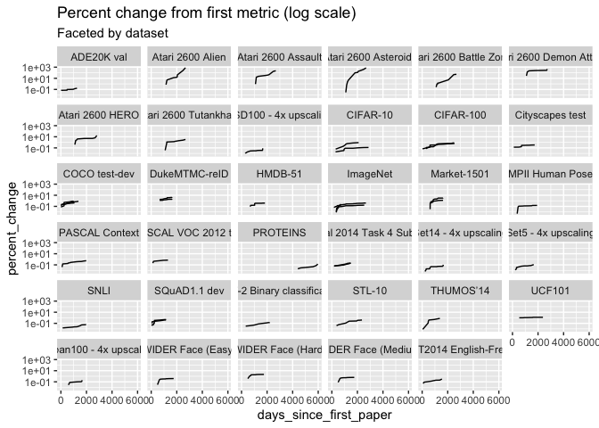
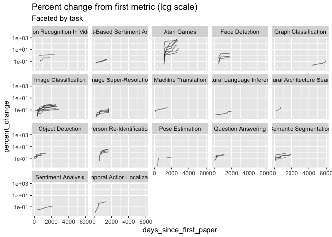
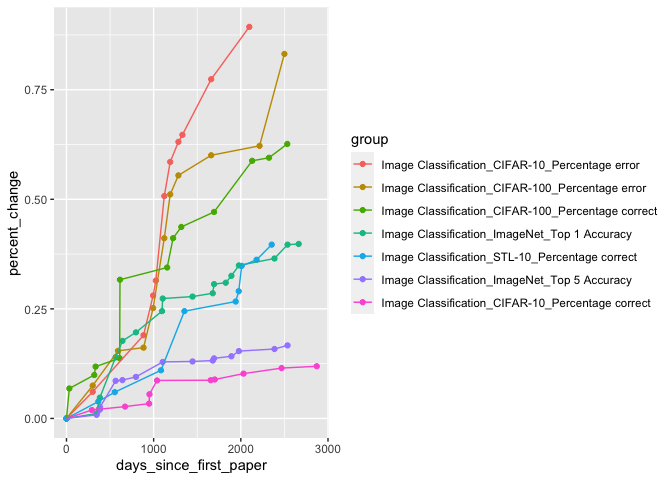
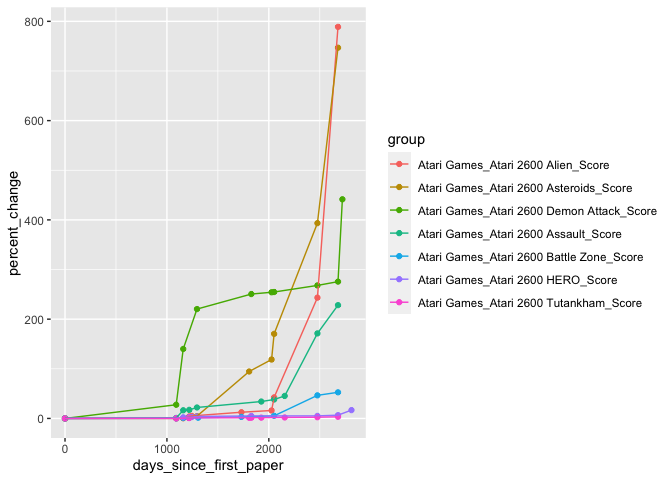

Papers with Code - SOTA
================
Sara Altman
2020-05-25

  - [Percent change over time](#percent-change-over-time)

``` r
# Libraries
library(tidyverse)
library(lubridate)

# Parameters
MIN_OBSERVATIONS <- 5
file_data <- here::here("data/sota/sota.rds")
#===============================================================================

sota <-
  file_data %>% 
  read_rds() %>% 
  drop_na(paper_date, metric_result) %>% 
  group_by(group) %>% 
  mutate(
    n_results = n(),
    percent_change = 
      (metric_result - first(metric_result, order_by = paper_date)) / 
      first(metric_result, order_by = paper_date),
    percent_change_lag = 
      (metric_result - lag(metric_result, order_by = paper_date)) / 
      lag(metric_result, order_by = paper_date),
    days_since_first_paper = (min(paper_date) %--% paper_date) / days(1),
    across(contains("percent"), abs)
  ) %>% 
  ungroup()

sota_10 <-
  sota %>% 
  filter(n_results >= 10)

sota_5 <-
  sota %>% 
  filter(n_results >= 5)
```

## Percent change over time

``` r
sota_10 %>%  
  filter(percent_change > 0) %>% 
  ggplot(aes(days_since_first_paper, percent_change, group = group)) +
  geom_line() +
  facet_wrap(vars(dataset)) +
  scale_y_log10() +
  labs(
    title = "Percent change from first metric (log scale)",
    subtitle = "Faceted by dataset"
  )
```

<!-- -->

``` r
sota_10 %>%  
  filter(percent_change > 0) %>% 
  ggplot(aes(days_since_first_paper, percent_change, group = group)) +
  geom_line(alpha = 0.5) +
  facet_wrap(vars(task)) +
  scale_y_log10() +
  labs(
    title = "Percent change from first metric (log scale)",
    subtitle = "Faceted by task"
  )
```

<!-- -->

``` r
plot_task <- function(data, task_) {
  data %>% 
  filter(task == task_) %>% 
  mutate(
    group = fct_reorder2(group, days_since_first_paper, percent_change)
  ) %>% 
  ggplot(aes(days_since_first_paper, percent_change, color = group)) +
  geom_point() +
  geom_line()
}

sota_10 %>% 
  plot_task("Image Classification")
```

<!-- -->

``` r
sota_10 %>% 
  plot_task("Atari Games")
```

<!-- -->
