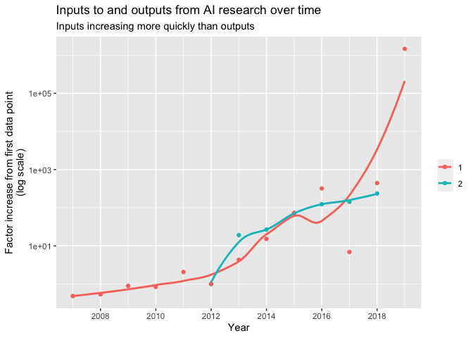

Aggregated inputs
================
Sara Altman
2020-12-04

  - [Outputs and inputs](#outputs-and-inputs)
  - [Models (not used)](#models-not-used)

``` r
# Libraries
library(tidyverse)
library(lubridate)
library(tidymodels)

# Parameters
  # Starting date
MIN_DATE <- "2008-01-01"
  # Ending date
MAX_DATE <- "2019-12-31"
  # Year to standardize values to
STANDARDIZE_YEAR <- 2012
  
vars_compute <- c("imagenet", "penn_treebank", "median_pfd")
var_output <- "sota_total_pct_change"

file_compute <-  
  here::here("data-raw/compute.csv")
file_funding <-
  here::here("data-raw/funding.csv")
file_sota <- 
  here::here("data/sota/sota.rds")
file_imagenet <- here::here("data-raw/imagenet.csv")
file_penn_treebank <-  
  here::here("data-raw/penn_treebank.csv")
file_authors <-       
  here::here("data/microsoft/ms_authors.rds")
#===============================================================================

# Geometric mean function
gm_mean = function(x, na.rm = TRUE){
  exp(sum(log(x[x > 0]), na.rm = na.rm) / length(x))
}

# Read in individual data sets
imagenet <- 
  read_csv(file_imagenet) %>% 
  transmute(year = as.integer(year), compute) %>% 
  rename(imagenet = compute)

penn_treebank <-
  read_csv(file_penn_treebank) %>% 
  select(year, compute = `compute (pfs)`) %>% 
  drop_na(compute) %>% 
  mutate(year = floor(year)) %>% 
  rename(penn_treebank = compute)

funding <- 
  read_csv(file_funding) %>% 
  drop_na(funding) %>% 
  select(year, funding)
  
compute <- 
  read_csv(file_compute) %>% 
  group_by(year = year(publication_date)) %>% 
  summarize(median_pfd = median(overall_peta_flop_days))

sota <- 
  read_rds(file_sota) %>% 
  mutate(year = year(paper_date)) %>% 
  filter(year <= year(MAX_DATE)) %>% 
  group_by(year) %>% 
  summarize(sota_total_pct_change = sum(percent_change) * 100) 

researchers <-
  file_authors %>% 
  read_rds() %>% 
  filter(date <= MAX_DATE) %>% 
  group_by(year = year(date)) %>% 
  summarize(total_authors = max(total_authors))

all <-
  list(researchers, funding, sota, compute, imagenet, penn_treebank) %>% 
  reduce(full_join, by = "year") %>% 
  filter(year >= year(MIN_DATE)) %>% 
  pivot_longer(
    cols = -year, 
    names_to = "variable", 
    values_to = "value",
    values_drop_na = TRUE
  ) %>% 
  group_by(variable) %>% 
  mutate(
    year = year - 1,
    value = value / first(value, order_by = year)
  ) %>% 
  ungroup() %>% 
  drop_na(value)

avg_compute <-
  all %>% 
  filter(variable %in% vars_compute) %>% 
  group_by(year, variable = "avg_compute") %>%
  summarize(value = gm_mean(value)) %>% 
  ungroup() %>% 
  mutate(value = value / value[year == 2012])

avg_input <-
  all %>% 
  filter(variable != var_output) %>% 
  group_by(year, variable = "avg_input") %>% 
  summarize(value = gm_mean(value)) %>% 
  ungroup() %>% 
  mutate(value = value / value[year == 2012])

df <-
  all %>% 
  filter(!variable %in% vars_compute) %>% 
  group_by(variable) %>% 
  mutate(value = value / value[year == 2012]) %>% 
  ungroup()
```

## Outputs and inputs

``` r
# Output data
outputs <-
  df %>% 
  filter(variable == "sota_total_pct_change") 

# Input data
inputs <-
  avg_input %>% 
  mutate(log_value = log10(value))

outputs %>% 
  bind_rows(inputs) %>% 
  ggplot(aes(year, value, color = variable)) +
  geom_point() +
  geom_smooth(se = FALSE) +
  scale_x_continuous(breaks = scales::breaks_width(2)) +
  scale_y_log10() +
  scale_color_discrete(labels = labels) +
  labs(
    x = "Year",
    y = "Factor increase from first data point\n(log scale)",
    color = NULL,
    title = "Inputs to and outputs from AI research over time",
    subtitle = "Inputs increasing more quickly than outputs"
  )
```

    ## `geom_smooth()` using method = 'loess' and formula 'y ~ x'

<!-- -->

## Models (not used)

``` r
# Model spec
lm_spec <-
  linear_reg() %>% 
  set_engine(engine = "lm")

output_fit <- 
  lm_spec %>% 
  fit(formula = value ~ year, data = outputs)

input_fit <- 
  lm_spec %>% 
  fit(
    formula = log_value ~ year, 
    data = inputs 
  )
```
