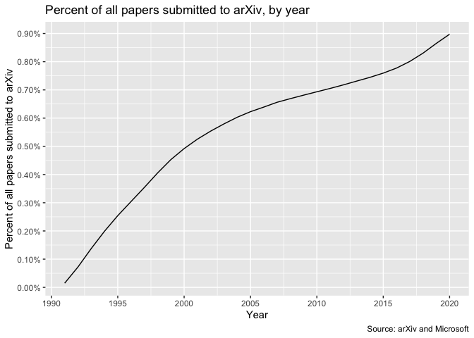

2020-12-04

  - [Percent of all papers published to
    arXiv](#percent-of-all-papers-published-to-arxiv)
  - [Factor increase - proportion of researchers on arXiv and new
    researchers](#factor-increase---proportion-of-researchers-on-arxiv-and-new-researchers)

``` r
# Libraries
library(tidyverse)
library(lubridate)

# Parameters
START_YEAR_ARXIV <- 1991
file_papers <- here::here("data/all/papers.rds")
file_researchers <- here::here("data/microsoft/ms_authors.rds")
#===============================================================================

papers <- 
  file_papers %>% 
  read_rds() %>% 
  filter(year >= START_YEAR_ARXIV)

researchers <-
  file_researchers %>% 
  read_rds() %>% 
  group_by(year = year(date)) %>% 
  summarize(new_authors = sum(new_authors)) %>% 
  mutate(
    total_authors = cumsum(new_authors),
    percent_increase_new_authors = 
      ((total_authors - lag(total_authors)) / lag(total_authors)) * 100
  ) %>% 
  filter(year >= START_YEAR_ARXIV)
```

## Percent of all papers published to arXiv

``` r
v <-
  papers %>%
  mutate(arxiv_to_all = cumsum(arxiv) / cumsum(ms)) %>% 
  filter(year >= START_YEAR_ARXIV)

v %>% 
  ggplot(aes(year, arxiv_to_all)) +
  geom_line() +
  scale_x_continuous(
    breaks = scales::breaks_width(5)
  ) +
  scale_y_continuous(
    labels = scales::label_percent(),
    breaks = scales::breaks_width(0.001)
  ) +
  labs(
    x = "Year",
    y = "Percent of all papers submitted to arXiv",
    caption = "Source: arXiv and Microsoft",
    title = "Percent of all papers submitted to arXiv, by year"
  )
```

<!-- -->

# Factor increase - proportion of researchers on arXiv and new researchers

``` r
v %>% 
  left_join(
    researchers %>% 
      select(year, total_authors), 
    by = "year"
  ) %>% 
  summarize(
    across(
      c(arxiv_to_all, total_authors), 
      list(
        `1991-2019` = ~ .[year == 2019] / .[year == 1991],
        `1999-2019` = ~ .[year == 2019] / .[year == 1999]
      )
      
    )
  ) %>% 
  pivot_longer(
    cols = everything(), 
    names_to = c("variable", "period"),
    names_pattern = "(.*)_(\\d+-\\d+)"
  ) %>% 
  pivot_wider(names_from = variable, values_from = value) %>% 
  rename(
    Period = period,
    `Proportion of researchers on arxiv factor increase` = arxiv_to_all,
    `Total researchers factor increase` = total_authors
  ) %>% 
  knitr::kable(digits = 3)
```

| Period    | Proportion of researchers on arxiv factor increase | Total researchers factor increase |
| :-------- | -------------------------------------------------: | --------------------------------: |
| 1991-2019 |                                             58.448 |                          1355.163 |
| 1999-2019 |                                              1.910 |                           121.161 |
