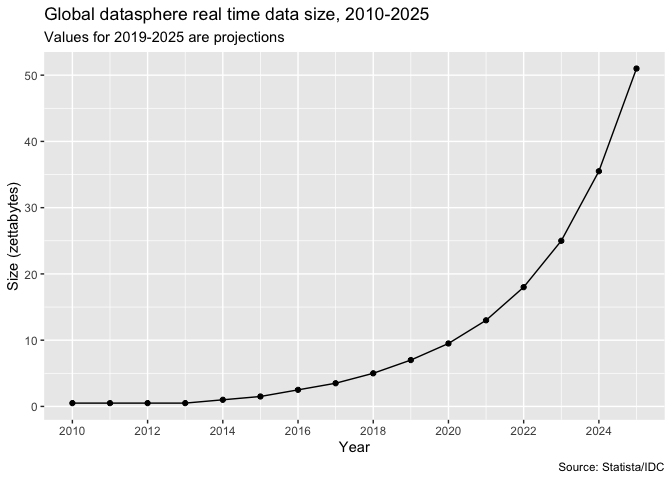
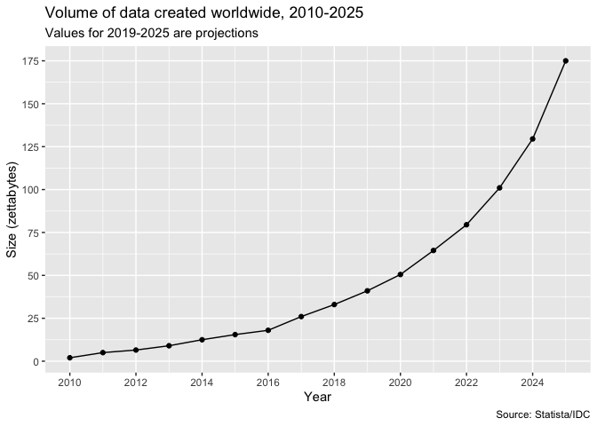

Datasphere
================
2020-12-04

  - [Global datasphere](#global-datasphere)
      - [Volume of data created
        worldwide](#volume-of-data-created-worldwide)

``` r
# Libraries
library(tidyverse)

file_datasphere <- here::here("data/datasphere/datasphere.csv")
file_data_created <- here::here("data/datasphere/data_created.csv")

#===============================================================================
datasphere <- 
  file_datasphere %>% 
  read_rds()
 
data_created <-
  file_data_created %>% 
  read_rds()
```

## Global datasphere

``` r
datasphere %>% 
  ggplot(aes(year, size)) +
  geom_point() +
  geom_line() +
  scale_x_continuous(breaks = scales::breaks_width(2)) +
  labs(
    x = "Year",
    y = "Size (zettabytes)",
    title = "Global datasphere real time data size, 2010-2025",
    subtitle = "Values for 2019-2025 are projections",
    caption = "Source: Statista/IDC"
  )
```

<!-- -->

### Volume of data created worldwide

``` r
data_created %>% 
  ggplot(aes(year, size)) +
  geom_point() +
  geom_line() +
  scale_x_continuous(breaks = scales::breaks_width(2)) +
  scale_y_continuous(breaks = scales::breaks_width(25)) +
  labs(
    x = "Year",
    y = "Size (zettabytes)",
    title = "Volume of data created worldwide, 2010-2025",
    subtitle = "Values for 2019-2025 are projections",
    caption = "Source: Statista/IDC"
  )
```

<!-- -->
