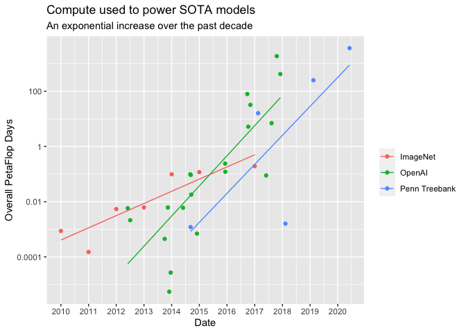

Compute
================
2020-12-04

  - [Overall PetaFlop vs. publication
    date](#overall-petaflop-vs.-publication-date)
  - [SOTA models: Overall PetaFlop vs. publication
    date](#sota-models-overall-petaflop-vs.-publication-date)

``` r
# Libraries
library(tidyverse)

# Parameters
file_compute <- here::here("data-raw/compute.csv")
file_compute_sota <- here::here("data-raw/compute_sota.csv")
file_penn_treebank <- here::here("data-raw/penn_treebank.csv")
file_imagenet <- here::here("data-raw/imagenet.csv")
#===============================================================================

compute <-
  file_compute %>% 
  read_csv()

compute_sota <-
  file_compute_sota %>% 
  read_csv() %>% 
  rename(compute = overall_petaflop_days)

penn_treebank <-
  file_penn_treebank %>% 
  read_csv() %>% 
  select(date, compute = `compute (pfs)`) %>% 
  drop_na(compute)

imagenet <-
  file_imagenet %>% 
  read_csv() %>% 
  mutate(date = lubridate::make_date(year = year)) %>% 
  select(date, compute) %>% 
  drop_na(compute)
```

## Overall PetaFlop vs. publication date

``` r
compute %>% 
  ggplot(aes(publication_date, overall_peta_flop_days)) +
  geom_point() +
  geom_line() +
  scale_x_date(date_breaks = "1 year", date_labels = "%b %Y") +
  scale_y_log10() +
  labs(
    x = "Publication date",
    y = "Overall PetaFlop Days",
    title = 
      "Overall PetaFlop Days vs. Publication Date"
  )
```

<!-- -->

## SOTA models: Overall PetaFlop vs. publication date

``` r
compute_sota %>% 
  mutate(group = "OpenAI") %>% 
  bind_rows(penn_treebank %>% mutate(group = "Penn Treebank")) %>% 
  bind_rows(imagenet %>% mutate(group = "ImageNet")) %>% 
  ggplot(aes(date, compute, color = group)) +
  geom_point() +
  geom_smooth(
    size = 0.5,
    method = "lm", 
    formula = 'y ~ x',
    se = FALSE
  ) +
  scale_x_date(date_breaks = "1 year", date_labels = "%Y") +
  scale_y_log10(
    breaks = c(1e-4, 1e-2, 1, 100),
    labels = c("0.0001", "0.01", "1", "100")
  ) +
  labs(
    x = "Date",
    y = "Overall PetaFlop Days",
    title = "Compute used to power SOTA models",
    subtitle = "An exponential increase over the past decade",
    color = NULL
  )
```

<!-- -->
