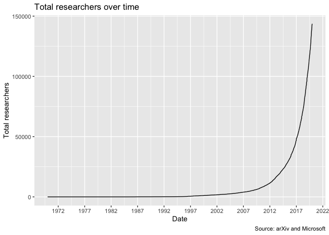
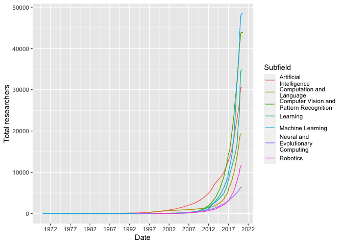

Visualizations
================
2020-05-15

  - [New researchers](#new-researchers)
      - [Total researchers over time](#total-researchers-over-time)
      - [New researchers (table)](#new-researchers-table)
      - [Factor increase (table)](#factor-increase-table)
      - [Total authors by subfield per
        year](#total-authors-by-subfield-per-year)
      - [Total authors by subfield per year
        (table)](#total-authors-by-subfield-per-year-table)

## New researchers

### Total researchers over time

<!-- -->

### New researchers (table)

| Year | New researchers | Total researchers | % new researchers | % growth of total researchers |
| ---: | --------------: | ----------------: | ----------------: | ----------------------------: |
| 1970 |               1 |                 1 |                NA |                            NA |
| 1971 |               3 |                 4 |             33.33 |                        300.00 |
| 1976 |               2 |                 6 |            150.00 |                         50.00 |
| 1985 |              14 |                20 |             14.29 |                        233.33 |
| 1986 |              28 |                48 |             50.00 |                        140.00 |
| 1987 |              41 |                89 |             68.29 |                         85.42 |
| 1988 |               4 |                93 |           1025.00 |                          4.49 |
| 1989 |               6 |                99 |             66.67 |                          6.45 |
| 1990 |              23 |               122 |             26.09 |                         23.23 |
| 1991 |              23 |               145 |            100.00 |                         18.85 |
| 1992 |              13 |               158 |            176.92 |                          8.97 |
| 1993 |              19 |               177 |             68.42 |                         12.03 |
| 1994 |              44 |               221 |             43.18 |                         24.86 |
| 1995 |              61 |               282 |             72.13 |                         27.60 |
| 1996 |             275 |               557 |             22.18 |                         97.52 |
| 1997 |             264 |               821 |            104.17 |                         47.40 |
| 1998 |             212 |              1033 |            124.53 |                         25.82 |
| 1999 |             185 |              1218 |            114.59 |                         17.91 |
| 2000 |             309 |              1527 |             59.87 |                         25.37 |
| 2001 |             195 |              1722 |            158.46 |                         12.77 |
| 2002 |             331 |              2053 |             58.91 |                         19.22 |
| 2003 |             305 |              2358 |            108.52 |                         14.86 |
| 2004 |             416 |              2774 |             73.32 |                         17.64 |
| 2005 |             483 |              3257 |             86.13 |                         17.41 |
| 2006 |             636 |              3893 |             75.94 |                         19.53 |
| 2007 |             669 |              4562 |             95.07 |                         17.18 |
| 2008 |             954 |              5516 |             70.13 |                         20.91 |
| 2009 |            1385 |              6901 |             68.88 |                         25.11 |
| 2010 |            2021 |              8922 |             68.53 |                         29.29 |
| 2011 |            2464 |             11386 |             82.02 |                         27.62 |
| 2012 |            3912 |             15298 |             62.99 |                         34.36 |
| 2013 |            4953 |             20251 |             78.98 |                         32.38 |
| 2014 |            5793 |             26044 |             85.50 |                         28.61 |
| 2015 |            7933 |             33977 |             73.02 |                         30.46 |
| 2016 |           12974 |             46951 |             61.15 |                         38.18 |
| 2017 |           18163 |             65114 |             71.43 |                         38.69 |
| 2018 |           31004 |             96118 |             58.58 |                         47.61 |
| 2019 |           47530 |            143648 |             65.23 |                         49.45 |

### Factor increase (table)

| Period    | New researchers factor increase | Total researchers factor increase |
| :-------- | ------------------------------: | --------------------------------: |
| 1999-2019 |                         256.919 |                           117.938 |
| 2009-2019 |                          34.318 |                            20.816 |

### Total authors by subfield per year

<!-- -->

### Total authors by subfield per year (table)

| year | Machine Learning (stat.ML) | Computer Vision and Pattern Recognition (cs.CV) | Artificial Intelligence (cs.AI) | Computation and Language (cs.CL) | Neural and Evolutionary Computing (cs.NE) | Learning (cs.LG) | Robotics (cs.RO) |
| ---: | -------------------------: | ----------------------------------------------: | ------------------------------: | -------------------------------: | ----------------------------------------: | ---------------: | ---------------: |
| 1970 |                          1 |                                               0 |                               0 |                                0 |                                         0 |                0 |                0 |
| 1971 |                          0 |                                               4 |                               0 |                                0 |                                         0 |                0 |                0 |
| 1976 |                          0 |                                               0 |                               5 |                                6 |                                         0 |                0 |                0 |
| 1985 |                          0 |                                              20 |                              19 |                                0 |                                         0 |                0 |                0 |
| 1986 |                         49 |                                               0 |                              47 |                               48 |                                         0 |                0 |                0 |
| 1987 |                          0 |                                               0 |                              90 |                                0 |                                         0 |                0 |                0 |
| 1988 |                          0 |                                               0 |                              94 |                                0 |                                         0 |                0 |                0 |
| 1989 |                          0 |                                             100 |                              97 |                                0 |                                         0 |                0 |                0 |
| 1990 |                          0 |                                               0 |                             119 |                              123 |                                         0 |                0 |                0 |
| 1991 |                          0 |                                               0 |                             146 |                                0 |                                         0 |                0 |                0 |
| 1992 |                          0 |                                               0 |                             159 |                                0 |                                         0 |                0 |                0 |
| 1993 |                          0 |                                             178 |                             176 |                              177 |                                       179 |                0 |                0 |
| 1994 |                          0 |                                             221 |                             217 |                              220 |                                       223 |                0 |                0 |
| 1995 |                          0 |                                             284 |                             276 |                              279 |                                       285 |                0 |                0 |
| 1996 |                        561 |                                             558 |                             335 |                              554 |                                         0 |                0 |                0 |
| 1997 |                        831 |                                             819 |                             623 |                              811 |                                       834 |              826 |                0 |
| 1998 |                       1031 |                                            1012 |                             902 |                             1008 |                                      1051 |             1017 |             1055 |
| 1999 |                       1240 |                                            1218 |                            1168 |                             1208 |                                      1248 |             1229 |             1259 |
| 2000 |                       1587 |                                            1539 |                            1440 |                             1525 |                                      1602 |             1586 |             1605 |
| 2001 |                          0 |                                            1788 |                            1731 |                             1777 |                                      1820 |             1806 |                0 |
| 2002 |                       2144 |                                            2086 |                            2015 |                             2074 |                                      2163 |             2121 |             2179 |
| 2003 |                       2468 |                                            2442 |                            2352 |                             2403 |                                      2495 |             2465 |             2513 |
| 2004 |                       2875 |                                            2840 |                            2749 |                             2805 |                                      2920 |             2870 |             2953 |
| 2005 |                       3405 |                                            3314 |                            3224 |                             3261 |                                      3464 |             3386 |             3482 |
| 2006 |                       4088 |                                            3950 |                            3821 |                             3876 |                                      4125 |             4034 |             4181 |
| 2007 |                       4770 |                                            4633 |                            4486 |                             4536 |                                      4871 |             4707 |             4918 |
| 2008 |                       5805 |                                            5579 |                            5313 |                             5406 |                                      5892 |             5708 |             5996 |
| 2009 |                       7341 |                                            6914 |                            6533 |                             6642 |                                      7443 |             7141 |             7539 |
| 2010 |                       9551 |                                            8859 |                            8267 |                             8354 |                                      9724 |             9229 |             9821 |
| 2011 |                      12253 |                                           11422 |                           10682 |                            10825 |                                     12454 |            11872 |            12639 |
| 2012 |                      16927 |                                           15144 |                           13913 |                            14155 |                                     17180 |            15807 |            17413 |
| 2013 |                      22592 |                                           20812 |                           18929 |                            19370 |                                     22944 |            21576 |            23242 |
| 2014 |                      29261 |                                           26971 |                           24339 |                            24929 |                                     29747 |            27882 |            30206 |
| 2015 |                      38891 |                                           35769 |                           31722 |                            32675 |                                     39347 |            37002 |            39897 |
| 2016 |                      54937 |                                           48983 |                           42284 |                            44190 |                                     55517 |            51993 |            56490 |
| 2017 |                      77577 |                                           68727 |                           59896 |                            62650 |                                     78455 |            72268 |            79946 |
| 2018 |                     117007 |                                           99383 |                           85692 |                            90043 |                                    117948 |           103155 |           120554 |
| 2019 |                     179931 |                                          146653 |                          127964 |                           134244 |                                    181273 |           162894 |           185057 |
| 2020 |                     194394 |                                          188611 |                          186436 |                           186836 |                                    194604 |           191735 |           195089 |
