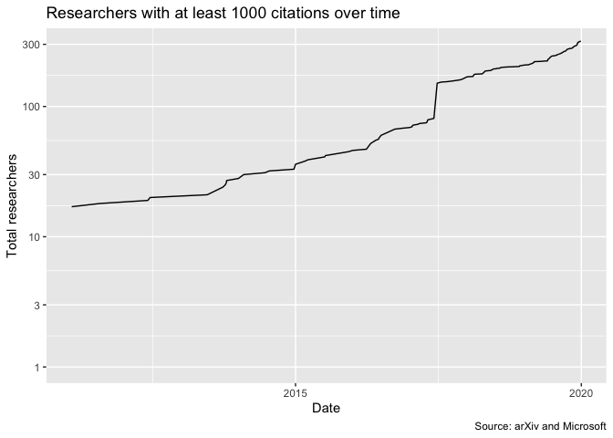

Researchers
================
2020-12-04

  - [New researchers](#new-researchers)
      - [Total researchers over time](#total-researchers-over-time)
      - [New researchers (table)](#new-researchers-table)
      - [Factor increase (table)](#factor-increase-table)
      - [Total authors by subfield per
        year](#total-authors-by-subfield-per-year)
      - [Total authors by subfield per year
        (table)](#total-authors-by-subfield-per-year-table)
  - [New researchers – citation
    thresholds](#new-researchers-citation-thresholds)

## New researchers

### Total researchers over time

<!-- -->

### New researchers (table)

| Year | New researchers | Total researchers | % new researchers | % growth of total researchers |
| ---: | --------------: | ----------------: | ----------------: | ----------------------------: |
| 1971 |               2 |                 2 |                NA |                            NA |
| 1976 |               2 |                 4 |            100.00 |                        100.00 |
| 1985 |               6 |                10 |             33.33 |                        150.00 |
| 1986 |              13 |                23 |             46.15 |                        130.00 |
| 1987 |              22 |                45 |             59.09 |                         95.65 |
| 1988 |               3 |                48 |            733.33 |                          6.67 |
| 1989 |               4 |                52 |             75.00 |                          8.33 |
| 1990 |              18 |                70 |             22.22 |                         34.62 |
| 1991 |              22 |                92 |             81.82 |                         31.43 |
| 1992 |               6 |                98 |            366.67 |                          6.52 |
| 1993 |              12 |               110 |             50.00 |                         12.24 |
| 1994 |             161 |               271 |              7.45 |                        146.36 |
| 1995 |             165 |               436 |             97.58 |                         60.89 |
| 1996 |             178 |               614 |             92.70 |                         40.83 |
| 1997 |             181 |               795 |             98.34 |                         29.48 |
| 1998 |             133 |               928 |            136.09 |                         16.73 |
| 1999 |             101 |              1029 |            131.68 |                         10.88 |
| 2000 |             203 |              1232 |             49.75 |                         19.73 |
| 2001 |             129 |              1361 |            157.36 |                         10.47 |
| 2002 |             167 |              1528 |             77.25 |                         12.27 |
| 2003 |             218 |              1746 |             76.61 |                         14.27 |
| 2004 |             309 |              2055 |             70.55 |                         17.70 |
| 2005 |             281 |              2336 |            109.96 |                         13.67 |
| 2006 |             427 |              2763 |             65.81 |                         18.28 |
| 2007 |             456 |              3219 |             93.64 |                         16.50 |
| 2008 |             649 |              3868 |             70.26 |                         20.16 |
| 2009 |             906 |              4774 |             71.63 |                         23.42 |
| 2010 |            1350 |              6124 |             67.11 |                         28.28 |
| 2011 |            1539 |              7663 |             87.72 |                         25.13 |
| 2012 |            2561 |             10224 |             60.09 |                         33.42 |
| 2013 |            3662 |             13886 |             69.93 |                         35.82 |
| 2014 |            3884 |             17770 |             94.28 |                         27.97 |
| 2015 |            4860 |             22630 |             79.92 |                         27.35 |
| 2016 |            8371 |             31001 |             58.06 |                         36.99 |
| 2017 |           13304 |             44305 |             62.92 |                         42.91 |
| 2018 |           24886 |             69191 |             53.46 |                         56.17 |
| 2019 |           55484 |            124675 |             44.85 |                         80.19 |

### Factor increase (table)

| Period    | New researchers factor increase | Total researchers factor increase |
| :-------- | ------------------------------: | --------------------------------: |
| 1999-2019 |                         549.347 |                           121.161 |
| 2009-2019 |                          61.241 |                            26.115 |

### Total authors by subfield per year

<!-- -->

### Total authors by subfield per year (table)

| year | Computer Vision and Pattern Recognition (cs.CV) | Artificial Intelligence (cs.AI) | Computation and Language (cs.CL) | Learning (cs.LG) | Neural and Evolutionary Computing (cs.NE) | Machine Learning (stat.ML) | Robotics (cs.RO) |
| ---: | ----------------------------------------------: | ------------------------------: | -------------------------------: | ---------------: | ----------------------------------------: | -------------------------: | ---------------: |
| 1971 |                                               2 |                               0 |                                0 |                0 |                                         0 |                          0 |                0 |
| 1976 |                                               0 |                               3 |                                4 |                0 |                                         0 |                          0 |                0 |
| 1985 |                                              13 |                              11 |                               12 |                0 |                                         0 |                          0 |                0 |
| 1986 |                                               0 |                              26 |                                0 |                0 |                                         0 |                          0 |                0 |
| 1987 |                                               0 |                              50 |                                0 |                0 |                                         0 |                          0 |                0 |
| 1988 |                                               0 |                              53 |                                0 |                0 |                                         0 |                          0 |                0 |
| 1989 |                                              57 |                              54 |                                0 |                0 |                                         0 |                          0 |                0 |
| 1990 |                                              78 |                              72 |                               75 |                0 |                                         0 |                          0 |                0 |
| 1991 |                                               0 |                              97 |                              100 |                0 |                                         0 |                          0 |                0 |
| 1992 |                                               0 |                             107 |                                0 |                0 |                                         0 |                          0 |                0 |
| 1993 |                                             120 |                             115 |                              119 |              121 |                                         0 |                          0 |                0 |
| 1994 |                                               0 |                             147 |                              294 |                0 |                                       296 |                          0 |                0 |
| 1995 |                                             468 |                             323 |                              464 |                0 |                                       469 |                          0 |                0 |
| 1996 |                                             656 |                             501 |                              652 |              657 |                                         0 |                        658 |                0 |
| 1997 |                                             847 |                             693 |                              841 |              851 |                                       853 |                          0 |              856 |
| 1998 |                                             980 |                             890 |                              976 |              990 |                                      1009 |                          0 |             1012 |
| 1999 |                                            1119 |                            1078 |                             1114 |             1126 |                                      1134 |                       1127 |             1142 |
| 2000 |                                            1329 |                            1232 |                             1316 |             1354 |                                      1363 |                       1357 |             1379 |
| 2001 |                                            1519 |                            1453 |                             1512 |             1527 |                                      1538 |                          0 |                0 |
| 2002 |                                            1684 |                            1625 |                             1673 |             1706 |                                      1722 |                          0 |             1745 |
| 2003 |                                            1942 |                            1871 |                             1921 |             1956 |                                      1979 |                       1957 |             1994 |
| 2004 |                                            2272 |                            2165 |                             2241 |             2293 |                                      2325 |                          0 |             2353 |
| 2005 |                                            2565 |                            2509 |                             2539 |             2610 |                                      2673 |                       2623 |             2702 |
| 2006 |                                            3026 |                            2910 |                             2968 |             3094 |                                      3126 |                       3096 |             3202 |
| 2007 |                                            3543 |                            3411 |                             3466 |             3581 |                                      3681 |                       3607 |             3756 |
| 2008 |                                            4223 |                            4027 |                             4117 |             4301 |                                      4468 |                       4375 |             4584 |
| 2009 |                                            5278 |                            4989 |                             5076 |             5439 |                                      5601 |                       5528 |             5674 |
| 2010 |                                            6720 |                            6246 |                             6352 |             6942 |                                      7257 |                       7120 |             7369 |
| 2011 |                                            8522 |                            7986 |                             8130 |             8779 |                                      9137 |                       8964 |             9329 |
| 2012 |                                           11174 |                           10233 |                            10486 |            11968 |                                     12445 |                      12242 |            12695 |
| 2013 |                                           15315 |                           13973 |                            14404 |            16262 |                                     16941 |                      16624 |            17222 |
| 2014 |                                           19954 |                           18050 |                            18642 |            20849 |                                     21826 |                      21415 |            22258 |
| 2015 |                                           25879 |                           23319 |                            24104 |            27082 |                                     28215 |                      27774 |            28721 |
| 2016 |                                           35576 |                           30822 |                            32451 |            37679 |                                     39509 |                      38942 |            40374 |
| 2017 |                                           51351 |                           43907 |                            46085 |            54784 |                                     57290 |                      56539 |            58772 |
| 2018 |                                           80144 |                           66397 |                            69769 |            87982 |                                     90194 |                      89249 |            93008 |
| 2019 |                                          130810 |                          104271 |                           110204 |           152520 |                                    157619 |                     156085 |           163846 |

## New researchers – citation thresholds

<!-- -->

<!-- -->
