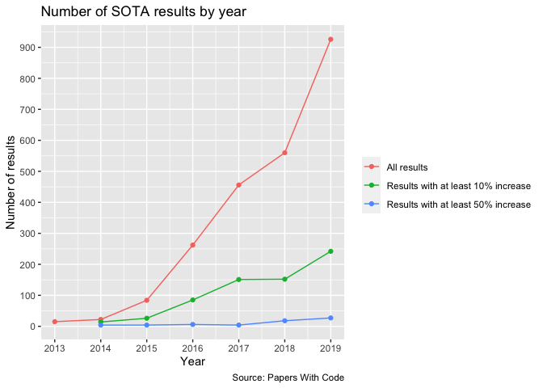

Papers with Code - SOTA
================
Sara Altman
2020-09-13

  - [Number of SOTA results, by year](#number-of-sota-results-by-year)
  - [Percent change over time](#percent-change-over-time)
  - [Average percent change per year](#average-percent-change-per-year)
      - [Table](#table)
      - [Plot](#plot)
  - [Total percent change by year](#total-percent-change-by-year)
      - [Table](#table-1)
      - [Plot](#plot-1)
  - [Models](#models)
  - [Investigation](#investigation)

## Number of SOTA results, by year

<!-- -->

    ## # A tibble: 8 x 8
    ##    year   all `10% increase` `50% increase` `100% increase` `10% increase (…
    ##   <dbl> <int>          <int>          <int>           <int>            <dbl>
    ## 1  2013    15              0              0               0              0  
    ## 2  2014    40             18              4               1             45  
    ## 3  2015   114             30              4               0             26.3
    ## 4  2016   353             91              6               0             25.8
    ## 5  2017   611            155              4               0             25.4
    ## 6  2018   730            170             18               0             23.3
    ## 7  2019  1195            269             27               0             22.5
    ## 8  2020   350             99             19               0             28.3
    ## # … with 2 more variables: `50% increase (percent)` <dbl>, `100% increase
    ## #   (percent)` <dbl>

## Percent change over time

<!-- -->

## Average percent change per year

    ## `summarise()` ungrouping output (override with `.groups` argument)

### Table

    ## # A tibble: 8 x 3
    ##    Year `Median percent change`     n
    ##   <dbl>                   <dbl> <int>
    ## 1  2020                     4.2   350
    ## 2  2019                     3.4  1195
    ## 3  2018                     3.5   730
    ## 4  2017                     3.8   611
    ## 5  2016                     4     353
    ## 6  2015                     4.3   114
    ## 7  2014                     7      40
    ## 8  2013                     2.1    15

### Plot

<!-- --><!-- -->

## Total percent change by year

    ## `summarise()` ungrouping output (override with `.groups` argument)

### Table

    ## # A tibble: 7 x 2
    ##    Year `Total percent change`
    ##   <dbl>                  <dbl>
    ## 1  2019                 9879. 
    ## 2  2018                 5988. 
    ## 3  2017                 5147. 
    ## 4  2016                 2961. 
    ## 5  2015                 1118  
    ## 6  2014                  800. 
    ## 7  2013                   41.7

### Plot

<!-- -->

## Models

<!-- -->

    ## # A tibble: 5 x 2
    ##   quantile  value
    ##   <chr>     <dbl>
    ## 1 0%       -4.77 
    ## 2 25%      -0.011
    ## 3 50%      -0.001
    ## 4 75%       0.006
    ## 5 100%      5.83

    ## # A tibble: 2 x 3
    ##   positive     n   pct
    ##   <lgl>    <int> <dbl>
    ## 1 FALSE      436 0.557
    ## 2 TRUE       347 0.443

## Investigation

    ## `summarise()` ungrouping output (override with `.groups` argument)

    ## # A tibble: 8 x 2
    ##   `year(paper_date)` percent_atari
    ##                <dbl>         <dbl>
    ## 1               2013             0
    ## 2               2014             0
    ## 3               2015             0
    ## 4               2016             0
    ## 5               2017             0
    ## 6               2018             0
    ## 7               2019             0
    ## 8               2020             0

    ## # A tibble: 0 x 2
    ## # … with 2 variables: paper_title <chr>, n <int>
